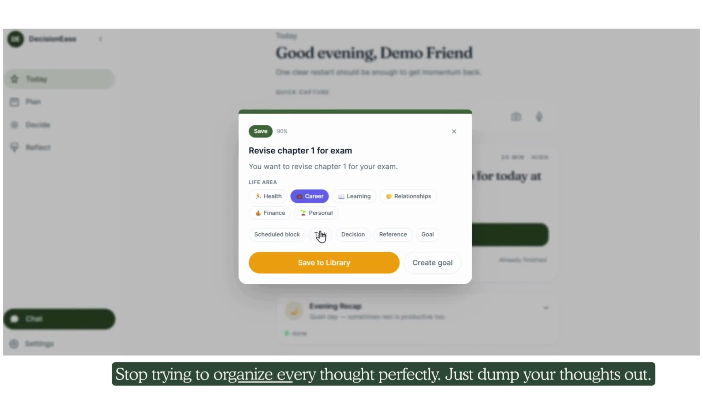

# DecisionEase

> An AI-powered decision support & execution PWA that helps you get things out of your head, decide what matters, and follow through — gently.

DecisionEase is a **cognitive relief and execution support system**, not just another notes app, task app, or AI chat app. It is designed for people who experience cognitive overload (with particular care for ADHD / executive-function users): it captures scattered thoughts, compresses ambiguity into one clear next move, places work into real time, and carries context across days so you never have to start over.

> 📦 **Note:** The source code for this project lives in a private repository. This README documents the system architecture and engineering approach publicly.
>
> 📖 For the product thinking and user journey design behind each screen, see [PRODUCT_OVERVIEW.md](./PRODUCT_OVERVIEW.md).

---

## 🎬 Demo

<!--
  HOW TO MAKE THESE PLAY INLINE ON GITHUB:
  GitHub only renders an inline video player for videos uploaded through its
  own editor. Open README.md in the GitHub web editor, drag-and-drop each .mp4
  from demo/ into the editor — GitHub generates an asset URL like
  https://github.com/user-attachments/assets/xxxx — then replace the
  poster+link blocks below with those bare URLs on their own line.
  Until then, the posters below link to the video files in the repo.
-->

**Product overview** — capture a thought, shape your plan, work through a real decision (40s):

[](demo/demo-overview.mp4)

| Walkthrough | What it shows |
|---|---|
| [📥 Capture (20s)](demo/demo-capture.mp4) | Brain-dump into Quick Capture → AI classifies it (type, life area, confidence) → it lands in your day, grouped by goal |
| [🗓 Smart scheduling (24s)](demo/demo-smart-scheduling.mp4) | AI Time Box proposes a full day with per-block reasoning → review → "Save to my day" → drag-and-drop to reprioritize |

---

## The Core Loop

```
capture → compress → review → decide → place → reflect
```

| Surface | The question it answers |
|---|---|
| **Today** | *What should I focus on right now?* — reduces overwhelm into a smaller, clearer now |
| **Review** | *What should I do with this thought, task, or resource?* — turns captures into decisions |
| **Schedule** | *Where does this fit, and how strongly does it matter?* — turns intent into visible time commitments |
| **Growth** | *What keeps happening, and what affects my follow-through?* — patterns, progress, reflection |
| **Chat** | *What kind of help do I need right now?* — catches mixed intent and bridges conversation into product actions |

### Product principles

1. **Reduce mental load first** — remove pressure before asking for action.
2. **Turn uncertainty into one next move** — never stop at insight.
3. **Enforce structure, not shame** — unfinished work needs an outcome, but the app never punishes.
4. **Protect Today from chaos** — `Must do` / `Planned` / `Flexible` / `Later` / `Not now` are distinct.
5. **Carry context across time** — memory, resurfacing, and carry-forward are core behavior, not polish.

---

## System Architecture

```
User → Next.js 14 PWA (Vercel)
         ↓ REST / WebSocket
       FastAPI (Python 3.12, async)
         ↓
       ┌─── Orchestrator Agent ───┐
       │  (intent classification)  │
       ├── Coach Agent             │ → OpenAI GPT-4o-mini (primary)
       ├── Planner Agent           │ → Gemini Flash (automatic fallback)
       ├── Analyst Agent           │
       ├── Curator Agent           │
       └── Companion Agent         │
               ↓                   ↓
         MCP Tools           Memory System
         (internal +         (4 layers)
          external)
               ↓                   ↓
      PostgreSQL + pgvector     Redis
      (durable state,        (session +
       embeddings)            cache)
```

**Stack:** FastAPI 0.115 · Next.js 14 (App Router) · PostgreSQL 15 + pgvector · Redis · OpenAI GPT-4o-mini + Gemini Flash fallback · `text-embedding-3-small` (1536-dim) · APScheduler · Zustand + TanStack Query · Tailwind CSS · Framer Motion · next-pwa

**Cost model:** the entire system runs for roughly **$10–22/month** — free-tier frontend hosting, free-tier Postgres and Redis, a small always-on backend instance, and pay-as-you-go LLM usage with strict per-call token budgets.

---

## The 6-Agent Multi-Agent System

Each agent has a narrow role, an explicit tool list, scoped memory access, and a hard response-token budget. Agents communicate through an internal A2A (agent-to-agent) protocol with timeouts, priority queuing, and no cycles.

```
                        ┌─────────────────┐
                        │  Orchestrator   │
                        │  (Router Hub)   │
                        └────────┬────────┘
                                 │
                 ┌───────────────┼───────────────┐
                 │               │               │
          ┌──────▼──────┐ ┌──────▼──────┐ ┌──────▼──────┐
          │   Coach     │ │  Planner    │ │  Analyst    │
          │ (Decision)  │ │ (Execution) │ │ (Patterns)  │
          └──────┬──────┘ └──────┬──────┘ └──────┬──────┘
                 │               │               │
                 └───────────────┼───────────────┘
                                 │
                    ┌────────────┴────────────┐
                    │                         │
              ┌─────▼──────┐            ┌─────▼──────┐
              │  Curator   │            │ Companion  │
              │ (Ingestion)│            │   (Tone)   │
              └────────────┘            └────────────┘
```

| Agent | Role | Highlights |
|---|---|---|
| **Orchestrator** | Central routing hub | Classifies intent into 6 categories (decision, planning, progress, capture, emotional, reflection), selects 1–2 agents, merges outputs, enforces autonomy gates. Activates on 100% of messages with a ~200-token routing budget. |
| **Coach** | Decision advisor & goal strategist | Pros/cons analysis, goal formation with clarifying questions, embedding-based "connect the dots" across past decisions, drift detection. |
| **Planner** | Daily execution & time orchestration | Morning briefs, one-at-a-time focus tasks, adaptive replanning, calendar scheduling, struggle detection via mood deltas. |
| **Analyst** | Progress tracking & pattern detection | Detects 7 pattern types: energy curve, focus rhythm, decision style, topic affinity, struggle triggers, growth velocity, social rhythm — each with confidence scores and evidence decay. Read-only over user state. |
| **Curator** | Content ingestion & organization | Capture with semantic deduplication, auto-tagging, embedding generation, priority-scored content queue, stale-content cleanup. |
| **Companion** | Tone & emotional intelligence layer | Rewrites every response in the user's preferred tone, celebrates wins, delivers gentle nudges. Always runs last; read-only memory access. |

**Key design constraints:**

- Common agent pairs call each other **directly** (Coach→Analyst, Planner→Curator) instead of always round-tripping through the hub.
- The A2A protocol carries `from_agent / to_agent / tool_name / params / priority / timeout`, falls back to cached data on timeout, and tracks token usage per call.
- Every autonomous behavior has an **off-switch** (autonomy gates: Full Auto / Suggest First / Notify Only / Off, plus quiet hours).

---

## 4-Layer Memory System

| Layer | Storage | Lifetime | Contents |
|---|---|---|---|
| **L1 Working** | Redis | Session | Current conversation thread, active focus context, decision-in-progress state |
| **L2 Profile** | PostgreSQL | Permanent | Tone preference, theme, autonomy gates, live goals, discovered traits |
| **L3 Episodic** | PostgreSQL + pgvector | 90-day decay | Past decisions, completions, achievements, struggles — similarity-searchable via embeddings |
| **L4 Semantic** | PostgreSQL + pgvector | Permanent w/ evidence decay | The 7 detected pattern types, with confidence that decays if a pattern stops recurring |

Episodic memories decay with a weighted formula (`recency + importance + access frequency`); patterns lose confidence if unconfirmed for 30+ days. Memory context assembly is capped (~2K tokens per agent call) so the LLM bill stays predictable.

---

## Domain-Event Consistency Architecture

A core engineering pillar: **one logical event → every dependent surface updated, regardless of entry point.**

Any state mutation (completing a task, ticking a milestone, expiring a schedule block, changing goal composition) can arrive via multiple entry points — REST button, PATCH, chat message, action chip, scheduled job, WebSocket. All of them funnel through a single **domain event bus** (`TaskCompleted`, `MilestoneCompleted`, `BlockExpired`, `GoalCompositionChanged`), whose subscribed consumers own the cascades:

```
TaskCompleted ──► close linked schedule blocks
              ──► recompute goal progress
              ──► auto-complete matching milestones
              ──► trigger celebration
              ──► invalidate synthesis caches
```

On the frontend, mutations fire typed change notifiers that dependent screens subscribe to — so a task completed in chat updates the Today, Plan, and Goals surfaces without a remount. Chat actions return a typed **action-result contract** (`success / entity / downstream surface / refresh targets / undo action`), and the UI is only allowed to claim success when the contract says so — eliminating an entire class of "the AI said it did it, but nothing happened" bugs.

---

## Backend

- **84 REST endpoints** across 19 domains (auth, tasks, goals, schedule, decisions, mood, analytics, chat, settings, integrations, …), plus a WebSocket streaming chat channel with REST fallback.
- Fully **async** SQLAlchemy 2.0 + Pydantic v2; JWT auth (short-lived access + refresh) with Google OAuth.
- **Raw SQL migrations** with an idempotent, tracked migration runner (applies cleanly to both SQLite in tests and PostgreSQL in production).
- **APScheduler** drives time-based behavior: morning brief (7am user-local), evening analysis, weekly pattern detection, hourly block-expiry lifecycle.
- **Timezone correctness as a first-class concern:** all scheduling resolves against a server-stored IANA timezone per user (never a client-side UTC offset), so cron jobs, DST transitions, and night-owl schedules land on the right calendar day.
- **LLM resilience:** primary/fallback model routing (GPT-4o-mini → Gemini Flash on errors), per-agent token budgets, embedding-based features kept on the cheapest viable model.

## Frontend

- **Next.js 14 App Router PWA** — installable, offline-capable (service worker via next-pwa), single-page tab navigation with a floating chat sheet.
- **ADHD-friendly, biophilic design system:** 3 themes (Nature / Minimal / Modern) via CSS custom properties, calm motion only, **no red anywhere** (warm amber for warnings, muted rose for gentle alerts — never guilt-triggering alarm colors).
- **WCAG AA accessibility:** 8.2:1 primary contrast, full keyboard navigation, 44px+ touch targets, `prefers-reduced-motion` respected throughout.
- **State discipline:** Zustand for client/global state, TanStack Query as the server-state source of truth, URL/state never duplicated.
- Mobile gestures (swipe to complete/skip, pull-to-capture) with Framer Motion spring animations.

## External Integrations

| Service | Purpose |
|---|---|
| OpenAI | Chat/agent reasoning + embeddings |
| Google Gemini | Automatic LLM failover |
| Google Calendar | Two-way event sync, free/busy-aware scheduling |
| Notion | Bidirectional task sync (per-user token) |
| Web Push | Morning brief, gentle nudges, milestone celebrations (VAPID) |
| Voice | Speech-to-text thought capture |

---

## Engineering Practices

This project is also an experiment in **harness-engineered, AI-assisted development** with unusually strict verification discipline:

- **TDD with RED-first gates** — no production code without a failing test; regression locks distinguished from feature tests.
- **The 3-layer contract** — every user-facing button must satisfy: (1) the UI promise is accurate, (2) the durable mutation actually happens, (3) downstream UI reflects it. A feature is not "done" when tests pass; it is done when a real user can complete the loop in a browser.
- **Live-Chrome UAT as a merge gate** — every surface-touching change is driven end-to-end in a real browser with before/during/after evidence, including failure-state verification (errors must be visible to the user, never just a console log).
- **Architecture Decision Records** — every contract-introducing decision is captured as an ADR the same session it's made, including the rejected alternatives and *why* they were rejected.
- **Small scoped PRs** — one PR per bug, one logical commit per feature slice, squash-merged.
- **Property-based state invariant testing** (Hypothesis stateful testing) over the task/goal/schedule state machine, plus a pytest-bdd acceptance layer that ratchets every fixed defect into a permanent symptom-level regression gate.
- **6-phase verification loop** before every merge: build → typecheck → lint → test (80%+ coverage target) → security scan → diff review.

---

## Architecture Highlights at a Glance

- 🤖 6 specialized agents with explicit boundaries, direct A2A calls, and per-call token budgets
- 🧠 4-layer memory with embedding search and human-like decay
- 🔄 Domain-event bus guaranteeing cross-surface consistency from any entry point
- 📡 Typed chat-action contracts — the AI can only claim what it actually did
- ⏰ Server-side IANA timezone model — DST-safe scheduling for a global user base
- 📱 Installable offline-capable PWA with an accessibility-first, anxiety-aware design system
- 💸 Production system on a hobby budget (~$10–22/mo) via aggressive model routing and token budgeting

---

## Status

DecisionEase is in **closed beta**. The current product phase focuses on *continuity and carry-forward*: visible commitment strength (`Must do` / `Planned` / `Flexible`), intentional outcomes for unfinished work (`Tomorrow` / `Later` / `Not now` / `Make smaller`), and noticing repeated slippage without ever becoming punitive.

<!-- Optional: add a live demo link / screenshots / waitlist link here -->

---

*Built with FastAPI, Next.js, PostgreSQL + pgvector, and a lot of care about what AI assistance should feel like for overloaded minds.*
