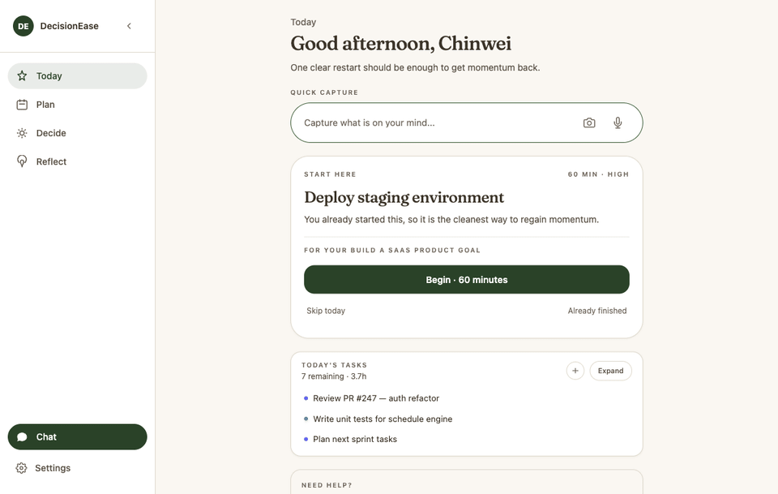

# DecisionEase

> A personal AI decision-support PWA that turns scattered thoughts into clear decisions and plans, with AI that remembers context across sessions.

## What it does

DecisionEase is a personal AI decision-support PWA for anyone drowning in scattered thoughts who wants to turn them into clear decisions and concrete plans. It runs a full loop, capture -> compress -> review -> decide -> schedule -> reflect, across five surfaces: Today, Plan, Decide, Reflect, and Chat. The AI remembers your context across sessions, so advice stays grounded in your own history.

## How it works

You capture a thought, an Orchestrator routes it to the right specialist agent (Coach, Planner, Analyst, Curator, or Companion), the agents use a 4-layer memory to ground advice in your history, and you get a goal-aware plan you can schedule and reflect on.

## Architecture / Built production-grade

- **6-agent system over an A2A protocol** — an Orchestrator routes to five specialists (Coach, Planner, Analyst, Curator, Companion) with per-agent token budgets, a 5000ms timeout, and a cached-data fallback so a slow agent never blocks a response.
- **4-layer memory architecture** — working memory in Redis, user-profile state in Postgres, an episodic event log, and a semantic layer on pgvector over 1536-dim OpenAI embeddings, so the system grounds advice in your full history.
- **MCP tool surface** — 7 internal tools plus 3 external integrations (Google Calendar, Notion, YouTube) all sitting behind a uniform `MCPTool` ABC for a consistent, extensible tool interface.
- **Resolved a production OAuth outage** by root-causing a missing Neon Postgres migration (`UndefinedColumnError`) and hardening with an idempotent migration runner plus a deploy-time drift check.
- **Converged a 3-engine scheduling fork** onto a single source of truth (`User.timezone`, IANA) for DST-correct planning.
- **Authored a 14-layer domain-event wiring map** and an event-bus single-writer pattern to eliminate stale-data and silent-failure bugs.
- **Practiced TDD with a 1,600+ automated test suite** and shipped 7+ scoped PRs in one working block under CI gating.
- **Orchestrated multi-agent LLM dev workflows** — parallel analysis -> adversarial verification -> synthesis.
- **PWA with an offline shell** — Next.js 14 + strict TypeScript + Zustand on the frontend, FastAPI + SQLAlchemy async on Neon Postgres on the backend, with Render/Vercel CI/CD.

## Tech stack

FastAPI, Next.js 14, PostgreSQL/pgvector (Neon), Redis, SQLAlchemy async, OpenAI (GPT-4o-mini), MCP, Zustand, TypeScript, Render/Vercel.

## Live demo

- **Landing page:** https://decision-ease-landing.vercel.app
- **Live app (behind login):** https://decisionease.vercel.app
- **Source:** Private repository — available on request

> Note for the maintainer: add the demo GIF (`demo.gif`) to the repo root so the embed above renders on GitHub.
